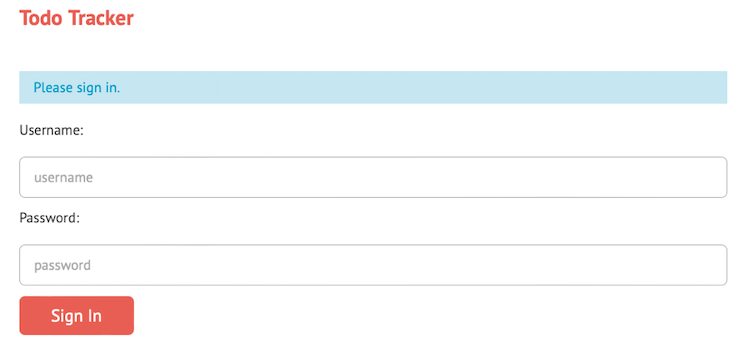
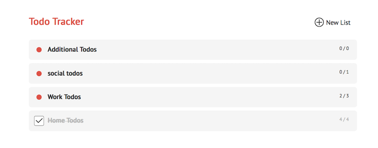

# Daily Tasks/TodoA app - Node.js, Express.js, Pug, CSS

## Overview
Daily tasks/todo app lets user create todo lists and populate the lists with tasks. Tasks can be completed or simply removed if necessary.

## Details
- Create todo lists and tasks for each list;
- Delete and update the name of the list;
- User is notified when a new task is added, deleted, or maked as done;
- App implements session management;
- Technologies: Node.js, Express.js, Pug.js, Heroku

Deployed [Here](https://thawing-springs-67929.herokuapp.com/users/signin)

